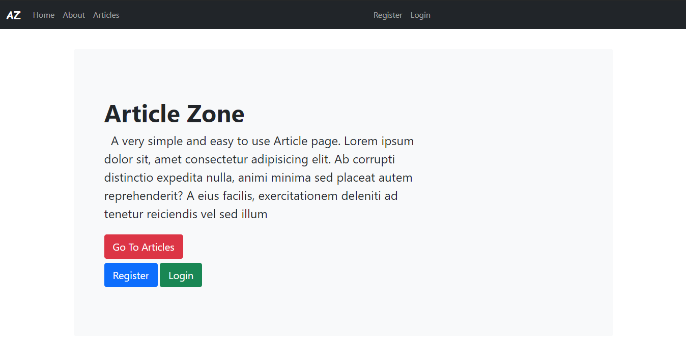
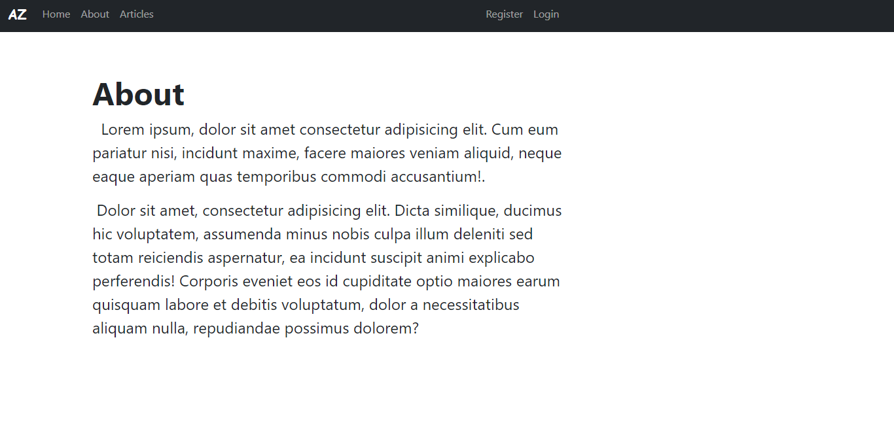
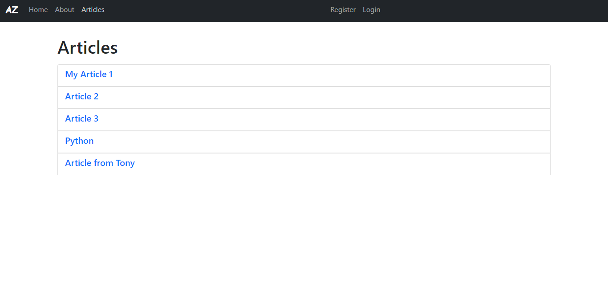
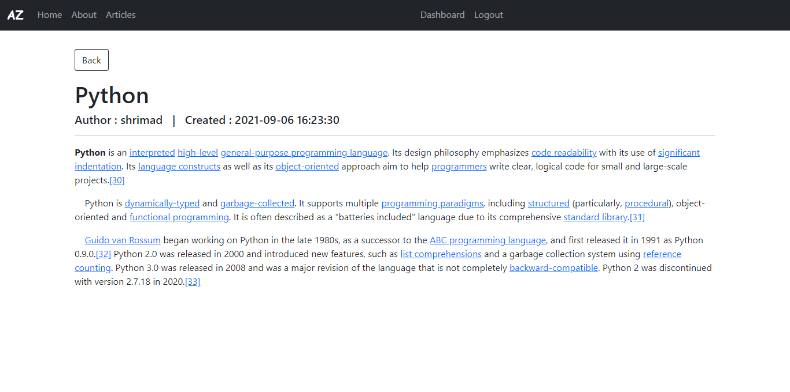
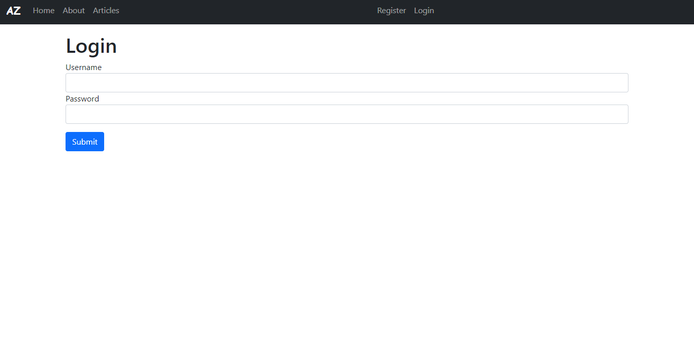
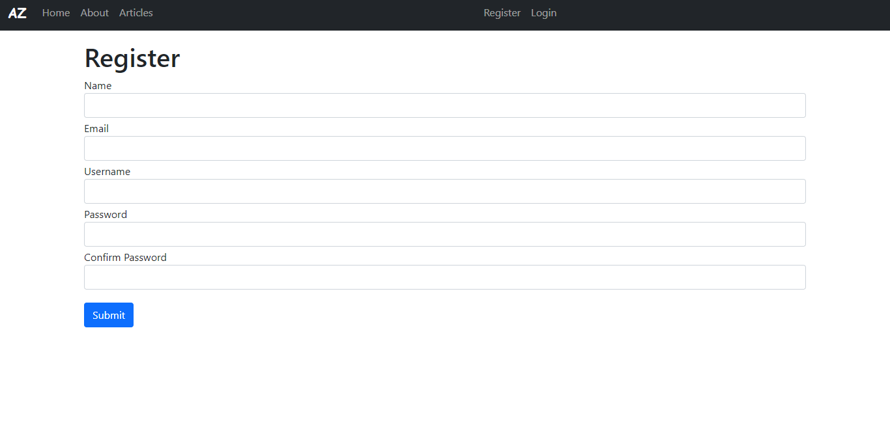
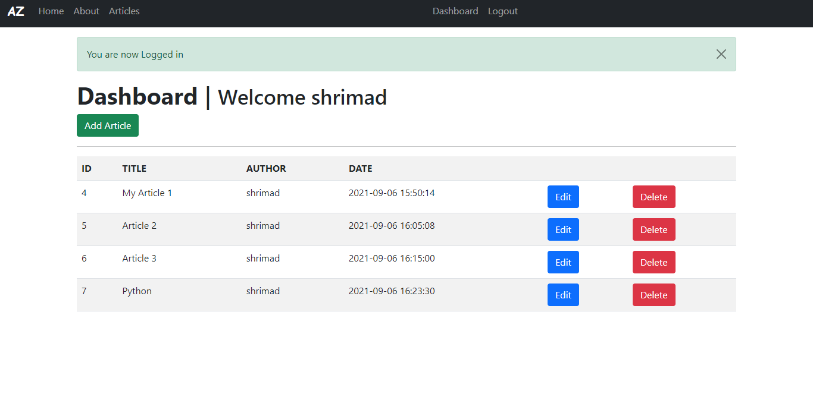

# Article-Zone

## [Setup](#setup-1)

## Home

## About

## Articles

## Article



## Login

## Register

## Dashboard



# Setup

## Clone the repository
```
git clone https://github.com/Shrimad-Bhagwat/Article-Zone.git
```

## Enter into the directory
```
cd Article-Zone
```

## Create virtual environment 
```
virtualenv env
```

## Activate virtual environment 
```
source env/bin/activate
```

## Install the dependencies
```
pip install -r requirements.txt
```

## Check migrations.
```
python manage.py makemigrations
```

## Apply migrations.
```
python manage.py migrate
```

## Starting the application
```
python manage.py runserver
```
